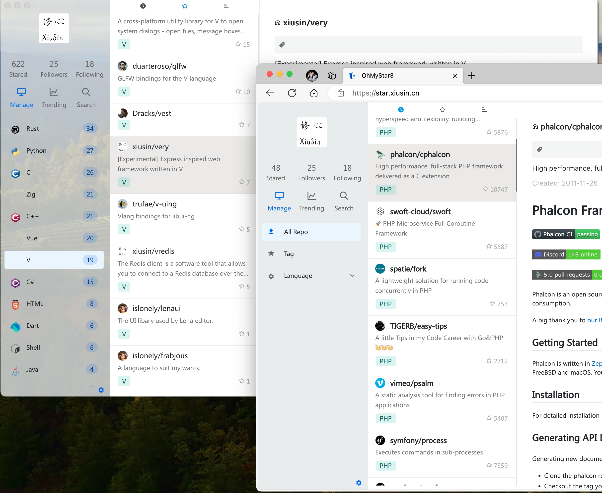

# OhMyStar3 #

## 项目介绍 ##
`OhMyStar3` 是一个开源的仓库管理工具，它能够帮助您管理您在 GitHub 上的 star，并提供自定义标签库的功能。与传统的仓库管理工具不同，GitStarManager 不需要与后端接口进行通信，完全依靠页面管理，并将数据存储在本地。此外，它还充分利用了浏览器缓存来提高性能，但标签内容将在缓存被清除后丢失，以确保您的数据的安全性和可靠性。

> 为了您的数据安全，对token仅开放只读权限。 项目保证不会将您的token保存到您浏览器之外的任何地方。

## 主要特性 ##

- 无需后端接口: 不需要与后端服务进行通信，提供纯页面管理的方式。您只需提供 GitToken，即可访问并管理您的 star 仓库。

- 仓库管理: 您可以轻松管理您在 GitHub 上 star 的仓库。您可以查看、搜索和筛选您关注的仓库列表，以便更方便地找到特定的仓库。

- 自定义标签库: 允许您创建自定义标签，并将其应用于您的 star 仓库。这样，您可以根据自己的需求和喜好对仓库进行分类、归档和组织。

- 本地数据存储: 所有的数据都存储在本地，不依赖于外部服务器。这意味着您可以随时随地使用 GitStarManager，而无需担心网络连接或服务器故障。

- 浏览器缓存优化: 利用浏览器缓存来提高性能和响应速度。仓库数据和标签信息将被缓存在本地，以便快速加载和浏览。然而，请注意，如果浏览器缓存被清除，标签内容将会丢失，以确保您的数据的安全性。

- 安全可靠: 不会保存您的 GitToken 或其他敏感信息。所有的数据都存储在您的本地浏览器中，确保您的数据的安全性和隐私。

`OhMyStar3` 是一款简洁而强大的仓库管理工具，为您提供安全、可靠且用户友好的管理解决方案。无论您是 GitHub 用户还是开源项目的贡献者，GitStarManager 都能助您更好地管理和组织 star 仓库。让我们一起享受高效而愉悦的仓库管理体验吧！
